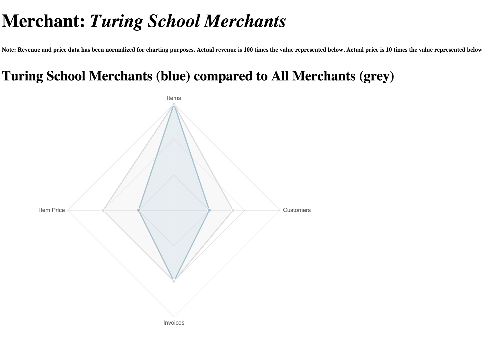

## Black Thursday

  For most if not all businesses today, Data is what makes a business run. Knowing your customers, merchants, products and items being sold and also at what price is essential today.  

  Most bigger companies or businesses utilize teams of data analysts for putting together and compiling long lengthy reports to try and learn more about the company.

  Black Thursday takes on the roll of data analyst and delivers analytics on the following:
  * Average items per merchant
  * Average items per merchant Standard Deviation
  * Average price of item sold by Merchant
  * "Golden Item's" sold
  * Average invoices per merchant
  * Average invoices per merchant Standard Deviation
  * Bottom performing merchants by invoice count
  * Percentage of invoices, Pending, Shipped or Returned
  * Invoices paid in full
  * Total amounts for all Invoices
##### Extensive Merchant analytics  
  * Merchants with high item count
  * Top merchants by invoice
  * Total revenue by date
  * Total revenue by earners
  * Top revenue earners
  * Merchants with pending invoices
  * Merchants with only one item
  * Merchants with only one item registered in Month
  * Revenue by Merchant
  * Most sold item for Merchant
  * Best item for Merchant

  Merchant Analytics Chart:

  Along with having access to these Merchant Analytics and more, all Merchant analysis can be exported to an online HTML page for easy viewing and presenting, just like example shown above.

#### How to run Merchant Analytics graph
  When looking for insight on a certain Merchant, navigate to the merchant_analytics.rb page, and type in the merchant id for whoever you're looking to query as shown below.

  Merchant Analytics Merchant ID Search:

  Then, go over the CLI and run the following commands when in the parent directory.

  ` ruby lib/merchant_analytics.rb`

  `open public/index.htm`

### Credits
###### By Kerry Sheldon and Colin Osborn

Find the original [project spec here](https://github.com/turingschool/curriculum/blob/master/source/projects/black_thursday.markdown).
